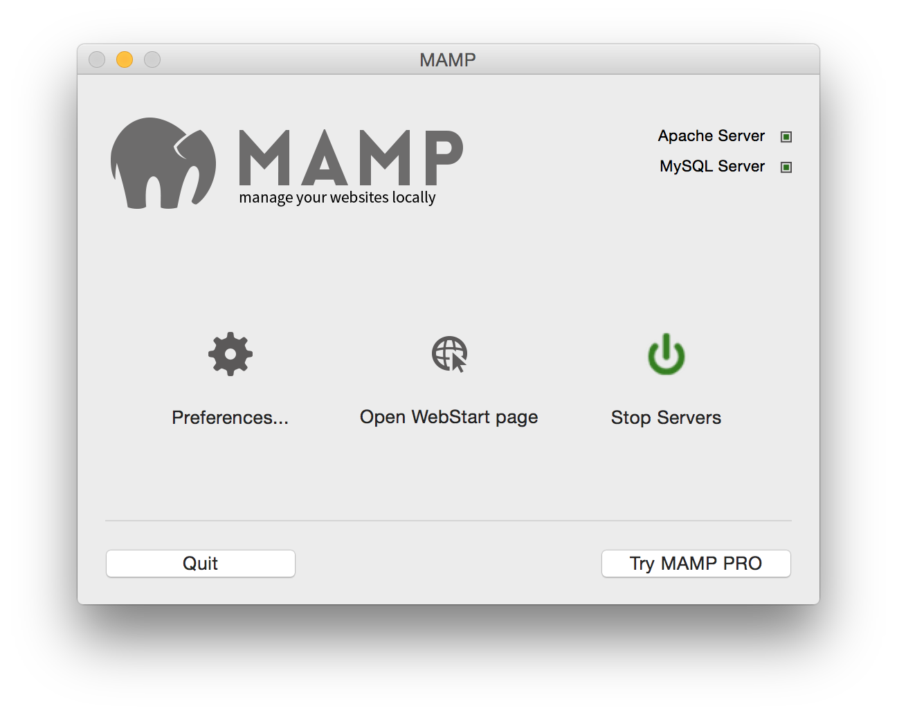

#upload

#Installation

* You need a computer running Apache and PHP. The best way to do this is to install [MAMP](http://www.mamp.info/en/) (or equivalent)
* Fire up MAMP and start the servers: 
*  Figure out the folder that MAMP will serve as a website ~[](images/2.png)
*  Now, copy these files there:

``` 
git clone https://github.com/sg-s/upload.git
```

and hack away. 
